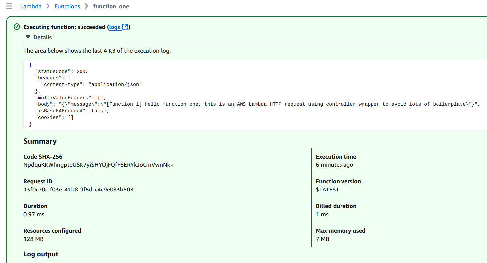
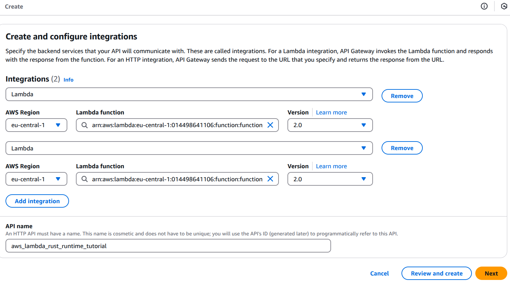
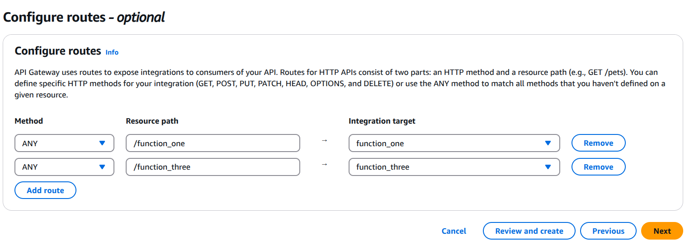
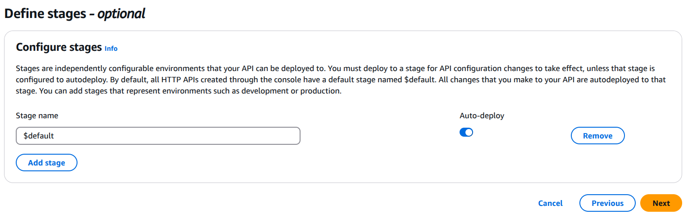
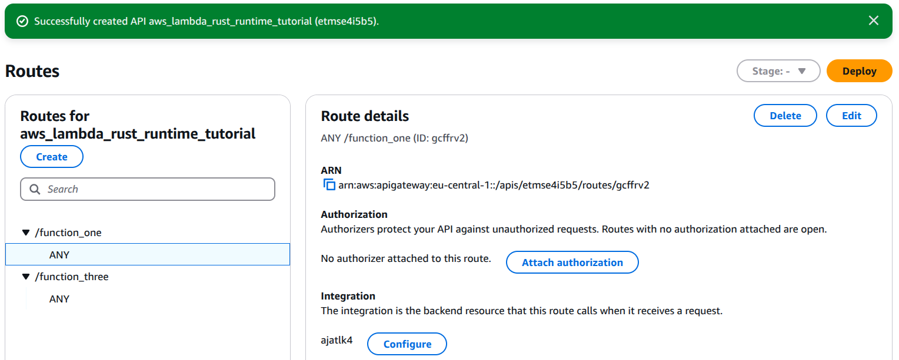

# 3. Deploy to AWS Lambda

In Lesson 1/2 I created a fully working setup for comfortable development on my local machine. (No database yet – that comes in the next lesson.)

Let's deploy everything to AWS Lambda now!

---

## Off-topic

But first let me talk a little bit about my current setup.

As you noticed, I do not use the default Rust/Cargo bin/lib project entry points. Instead, I define my own custom main source files. This introduces a sort of duplication in the `Cargo.toml` files, which isn’t that bad; however, some may prefer to stick with Rust/Cargo defaults. So I will create an additional example function called `function_four` to illustrate an alternative approach.

```bash
cd app/functions/
cargo new function_four
```

`app/functions/function_four/Cargo.toml`

```toml
[package]
name = "function_four"
version = "0.1.0"
edition = "2021"

[dependencies]
tokio = { workspace = true }
serde = { workspace = true }

# internal dependencies
lambda_http_wrapper = { path = "../../libraries/lambda_http_wrapper"}
```

`app/functions/function_four/src/main.rs`

```rust
use lambda_http_wrapper::Error;

use lambda_http_wrapper::run;

mod controller;
use controller::handle;
mod types;

#[tokio::main]
async fn main() -> Result<(), Error> {
    run(handle).await
}
```

`app/functions/function_four/src/types.rs`

```rust
//! This module defines the “API types” that your controllers use.

use serde::{Deserialize, Serialize};

/// Your application’s Request – you can add more fields as needed (e.g. headers, body).
#[derive(Debug, Serialize, Deserialize)]
pub struct Request {
    /// For simplicity we extract just the query parameters.
    pub name: String,
}

/// Your successful Response.
#[derive(Debug, Serialize, Deserialize)]
pub struct Response {
    pub message: String,
}

/// Your Error Response.
#[derive(Debug, Serialize, Deserialize)]
pub struct ErrorResponse {
    pub error: String,
}
```

`app/functions/function_four/src/controller.rs`

```rust
use crate::types::*;

/// This is “business logic” controller
pub(crate) async fn handle(req: Request) -> Result<Response, ErrorResponse> {
    // For example, get a "name" from the query string (defaulting to "world")
    let name = req.name;

    // Here you would call into your service layer, etc.
    Ok(Response {
        message: format!("[Function_4] Hello {}, this is an AWS Lambda HTTP request using controller wrapper to avoid lots of boilerplate", name),
    })
}
```

This approach has its benefits: next time you want to add another Lambda function to your project, you simply copy an existing function’s directory, change the package name in its `Cargo.toml`, add it to the top-level workspace `Cargo.toml`, and (optionally) modify its request/response types and controller logic. You can choose between using the default approach or my fully custom approach — the choice is yours.

## Deploying to AWS Lambda using cargo-lambda

In project root:

```bash
$ cargo lambda build --release

$ cargo lambda deploy function_one
✅ function deployed successfully 🎉
🛠️  binary last compiled a minute ago
🔍 arn: arn:aws:lambda:eu-central-1:014498641106:function:function_one
🎭 version: 1

$ cargo lambda deploy function_three
✅ function deployed successfully 🎉
🛠️  binary last compiled 12 minutes ago
🔍 arn: arn:aws:lambda:eu-central-1:014498641106:function:function_three
🎭 version: 1
```

Perfect. The deployment tool takes care of building and uploading my functions to AWS Lambda.

Function cold startup time is about 35–50ms, while execution durations are around 1ms (typically billed as 2ms when rounded up). I can see the functions in the AWS Console and test them using the `apigateway-http-api-proxy` template. Note that when testing a Lambda function in the AWS Console, you must supply all the required internal details. For example, the API Gateway proxy template supplies a base64‑encoded body (which you can decode with [base64encode.org](https://www.base64encode.org/)):

```json
...
  "body": "eyJuYW1lIjoiZnVuY3Rpb25fb25lIn0=",
...
```

Testing in the AWS Console yields a response like this:

```json
{
  "statusCode": 200,
  "headers": {
    "content-type": "application/json"
  },
  "multiValueHeaders": {},
  "body": "{\"message\":\"[Function_1] Hello function_one, this is an AWS Lambda HTTP request using controller wrapper to avoid lots of boilerplate\"}",
  "isBase64Encoded": false,
  "cookies": []
}
```

This is also how it appears on the AWS Lambda Dashboard:



## Configure AWS locally

For me, deploying to AWS works right away because I’ve used the AWS CLI many times and it’s already configured on my machine. If you’re setting this up for the first time and you don’t have the AWS CLI installed or configured yet, follow these steps:

### 1. Install AWS CLI

**macOS:**

If you have Homebrew installed, run:

```bash
brew update && brew install awscli
```

**Windows:**

Download the AWS CLI MSI installer from the [AWS CLI Installation page](https://docs.aws.amazon.com/cli/latest/userguide/getting-started-install.html) and run the installer.

**Linux:**

Download and install using the following commands:

```bash
curl "https://awscli.amazonaws.com/awscli-exe-linux-x86_64.zip" -o "awscliv2.zip"
unzip awscliv2.zip
sudo ./aws/install
```

After installation, verify the installation by running:

```bash
aws --version
```

You should see output similar to `aws-cli/2.x.x Python/3.x.x Linux/...`.

### 2. Obtain Your AWS Access Keys

1. Log In to the AWS Management Console:
   Go to **AWS Console** and log in.

1. Navigate to IAM:
   In the **AWS Console**, search for and open **IAM** (Identity and Access Management).

1. Create a New User (if needed):

   - In the **IAM** dashboard, click on Users in the sidebar.
   - Click **Add user**.
   - Enter a `username` (e.g., aws-cli-user).
   - Select `Programmatic access` as the access type.
   - Click **Next: Permissions**.
   - Attach a policy such as `AdministratorAccess` for testing (for production, consider a policy with only the required permissions).
   - Click through to create the user.

1. Save Your Access Keys:
   After the user is created, you’ll see an `Access key ID` and a `Secret access key`. Save these credentials securely (you won’t be able to see the secret access key again).

### 3. Configure AWS CLI

Open your terminal and run:

```bash
aws configure
```

When prompted, enter the following:

- `AWS Access Key ID`: (your access key ID)
- `AWS Secret Access Key`: (your secret access key)
- `Default region name`: (e.g., eu-central-1 or the region you use)
- `Default output format`: (e.g., `json`)

These settings are saved in `~/.aws/credentials` and `~/.aws/config`.

### 4. Test Your Configuration

Run a simple command to confirm that your AWS CLI is properly configured:

```bash
aws sts get-caller-identity
```

You should receive a JSON output with details about your AWS account.

Note: Keep your AWS credentials secure and never expose them publicly or commit them to version control.

Now you’re ready to deploy your Lambda functions using `cargo lambda deploy...` — the AWS CLI will supply the necessary credentials for authentication.

## Configure AWS API Gateway to expose functions to web

To use my AWS Lambda functions as HTTP handlers in web applications, I need to expose them via **AWS API Gateway**. This allows my Lambda functions to be accessed via a standard HTTP(S) URL. Below, I'll walk you through setting up **API Gateway**.

### 1. Check Lambda Functions

Ensure your functions are deployed and correctly configured as HTTP handlers.

```bash
aws lambda list-functions
```

Find function’s **ARN** (Amazon Resource Name) from the output.

### 2. Create an HTTP API in AWS API Gateway









1. Go to **API Gateway** in **AWS Console**:
   - Click **Create API** → Select **HTTP API** and click **Build**.
1. Configure API Gateway:
   - Integration type: Lambda function.
   - Lambda function: Choose your function (e.g., function_one).
   - Region: Ensure it's the same as your Lambda function.
   - Click **"Next"** until you reach **"Review and Create"**
   - Click **"Create API"**.
1. Get the API Gateway URL:

   - Once your API is created, go to Stages → Click on "Default stage".
   - Copy the Invoke URL, which looks like:

   ```plain
   https://your-api-id.execute-api.your-region.amazonaws.com/
   ```

### 3. Set Up Routes for Each Lambda Function

By default, API Gateway does not expose your function at a specific path. You must define routes manually.

1. In your API Gateway:
   - Click on **Routes → Create a route**.
   - Choose the method (`GET`, `POST`, etc.).
   - Set the path (e.g., `/function_one`).
   - Click **Create Route**.
1. Go to "Integrations" → Click Create Integration:
   - Choose **"Lambda function"**.
   - Select the corresponding Lambda function.
   - Click **Create Integration**.
1. Repeat for each function (e.g., `/function_three`, `/function_three`).

### 4. Enable CORS (If Calling from a Web App)

If client web app runs in a browser and is hosted on a different domain, I must enable **CORS** (Cross-Origin Resource Sharing).

- In **API Gateway**, go to **Routes** → Select route (`/function_one`).
- Click **"Enable CORS"** and configure:
  - Allowed methods: `GET, POST, OPTIONS`
  - Allowed origins: `*` (or specify your domain)
  - Allowed headers: `Content-Type`
- Click **"Deploy Changes"**.

### 5. Deploy and Test the API

- Click on **"Deploy API"** and select the stage (`default`).
- Get the **Invoke URL**, e.g.:

```plain
https://your-api-id.execute-api.your-region.amazonaws.com/function_one
```

Test it with cURL:

```bash
$ curl https://etmse4i5b5.execute-api.eu-central-1.amazonaws.com/function_one
{"error":"Expected JSON body, got empty body"}

$ curl https://etmse4i5b5.execute-api.eu-central-1.amazonaws.com/function_one -H "Content-Type: application/json" -d '{"name": "lambda"}'
{"message":"[Function_1] Hello lambda, this is an AWS Lambda HTTP request using controller wrapper to avoid lots of boilerplate"}

$ curl https://etmse4i5b5.execute-api.eu-central-1.amazonaws.com/function_three
{"message":"[Function_3] Hello function_three, this is an AWS Lambda HTTP request using controller wrapper to avoid lots of boilerplate"}
```

Now I have my **AWS Lambda** functions written in **Rust** language deployed to **AWS Lambda** and served by **API Gateway** in web.

## Automating the Deployment Process

In this lesson, I manually set up AWS API Gateway to expose my Lambda functions as REST API endpoints. While this approach works, I do not want to repeat these steps every time I update my functions or add new ones. In real-world applications, I want to automate this entire process using a **CI/CD pipeline**.

A proper CI/CD setup will:

- Automatically build and deploy my Lambda functions.
- Provision API Gateway routes dynamically.
- Configure permissions, CORS, and environment variables automatically.
- Ensure every deployment is seamless and reproducible.

Setting up **Infrastructure as Code (IaC)** using **AWS CloudFormation**, **Terraform**, or **Serverless Framework** will allow me to define my entire API setup declaratively. This means I will no longer need to manually configure API Gateway or IAM permissions—I will describe everything in code and let my deployment pipeline handle the rest.

I will cover this automation in a separate lesson, where I will integrate my AWS Lambda deployment into a CI/CD workflow.

For now, in its current state, this project is ready for **simple try-out or proof-of-concept (PoC) projects**, where I do not need a complex setup and can manually configure API Gateway as needed.

[Browse the code at Lesson 3 checkpoint](https://github.com/BootstrapLaboratory/aws_lambda_rust_runtime/tree/lesson-3)
